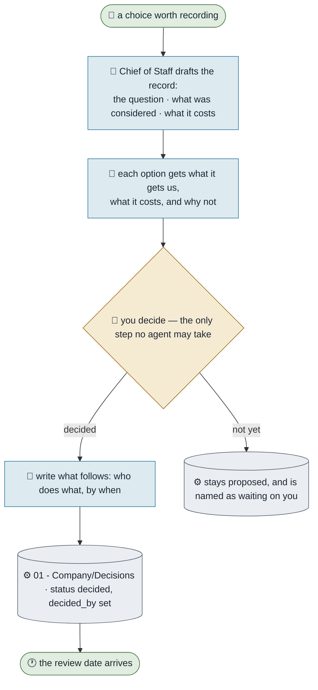

# Making a Decision

**Purpose.** Make decisions once, in writing, with the reasoning attached — so that in six months you can
tell the difference between a decision and a habit.
**Trigger.** A choice that would be expensive to reverse, or that someone will ask about later.
**Done means.** A decision record exists, a person set it to `decided` with their name on it, and what
follows from it is written down.
**Owner.** Chief of Staff prepares; a person decides.

## How it runs today

## The steps

| # | Step | Who | What they need | What comes out |
|---|---|---|---|---|
| 1 | Name the question in one sentence | Chief of Staff | The conversation | A record at `proposed` |
| 2 | List the options honestly, including doing nothing | Chief of Staff | Evidence, tagged [F]/[A]/[R] | A comparison |
| 3 | Decide | You | The record | `decided`, `decided_by`, a date |
| 4 | Write what follows | Chief of Staff | The decision | Owned consequences |
| 5 | Set a review date | You | Judgement | `review_on` |

## Where it breaks

| The exception | How often | What we do |
|---|---|---|
| The decision was already made in a chat | Constantly | Write it down after the fact and say so — an unwritten decision gets re-litigated |
| Nobody sets a review date | Most records | The check lists decisions past review; the weekly close disposes of them |
| A record is drafted and never decided | The main failure | It is named in the picture as waiting on you, with how long it has waited |

## What it would take to automate

| Step | Could an agent do it? | What is missing |
|---|---|---|
| 1, 2, 4 | Yes | Nothing |
| 3, 5 | No, by design | It is your decision. That is the whole point of writing it down |
