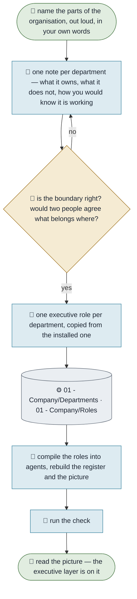

# Setting Up a Department

**Purpose.** Turn the parts you already talk about into named departments, each with one executive who
answers for it. For a company that is sales, delivery, "the money stuff". **For one person it is every
part of their own job** — the accounts you look after, the reports you produce, the LinkedIn posting,
the thing you inherited and nobody else touches. **This is the first thing you do after installing**, before any
workflow, because a workflow with no department is a note nobody owns.
**Trigger.** The install has finished, or the organisation has grown a part that nobody currently answers for.
**Done means.** A department note exists, one executive role points at it, the agent is compiled, and the
check is green.
**Owner.** Chief of Staff.

## How it runs today

## The steps

| # | Step | Who | What they need | What comes out |
|---|---|---|---|---|
| 1 | List the parts of your own job, or of the organisation | You | Nothing but your own words | Three to six names — not twelve |
| 2 | Write one note per department | Chief of Staff | `_Templates/Department.md` | What it owns, **where it stops**, and one sentence for *working* |
| 3 | Check the boundaries | You | The notes | Two people would file the same thing in the same place |
| 4 | Give each one an executive | Chief of Staff | `01 - Company/Roles/Chief of Staff.md` as the shape | One role note per department, `department:` filled in |
| 5 | Compile and rebuild | Chief of Staff | The generators | An agent per executive, and a picture that shows the layer |
| 6 | Run the check | Chief of Staff | — | Green, or a named reason it is not |

## Where it breaks

| The exception | How often | What we do |
|---|---|---|
| Twelve departments on the first pass | Almost always | Three to six. If two of them would never disagree about anything, they are one |
| One person leads four of them | Normal in a small company | Fine — the *department* is the unit of accountability, not the headcount. The same person can answer for several |
| A department nobody can describe without using the word "various" | Common | It is not a department yet. Leave it out and let the work show you what it is |
| "Why write down what it does **not** own?" | Asked every time | Because an agent always answers. Ask one something just outside its ground and it will not say *that is not mine* — it will produce something confident and plausible about a subject it knows nothing about, and the answer will look exactly like a good one. The stop line is what makes its other answers trustworthy |
| Two departments both claim the same work | Common, and useful | Write the boundary into `not_owned:` on both sides. The argument is cheaper now than in six months |
| Renaming one later | Expected | Rename the note and the role's `department:`, then rebuild. The check names any role left pointing at a department that no longer exists |

## What it would take to automate

| Step | Could an agent do it? | What is missing |
|---|---|---|
| 2, 4, 5, 6 | Yes, today | Nothing — an agent writes the notes, compiles the layer and runs the check |
| 1 | No | Which parts your organisation actually has is yours to say |
| 3 | No | Whether a boundary is right is a judgement, and a wrong one is expensive |
