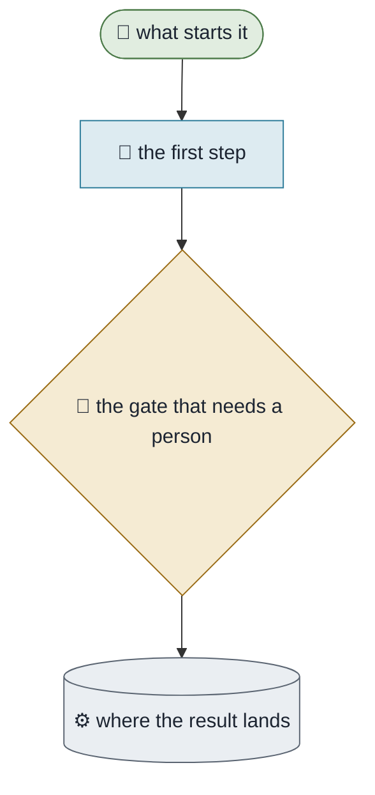

# {{title}}

**Purpose.** What this workflow is for, in one or two sentences.
**Trigger.** What starts it.
**Done means.** How you know it finished — a condition, not a feeling.
**Owner.** Who is accountable when it goes wrong.

## How it runs today

Draw the current state, not the intended one. If a step is a person copying something by hand, draw the
person copying something by hand.

## The steps

| # | Step | Who | What they need | What comes out |
|---|---|---|---|---|
| 1 | | | | |

## Where it breaks

| The exception | How often | What we do |
|---|---|---|

## What it would take to automate

| Step | Could an agent do it? | What is missing |
|---|---|---|

## Improvements proposed

Kept separate from the current state on purpose. A proposal is not a description.
