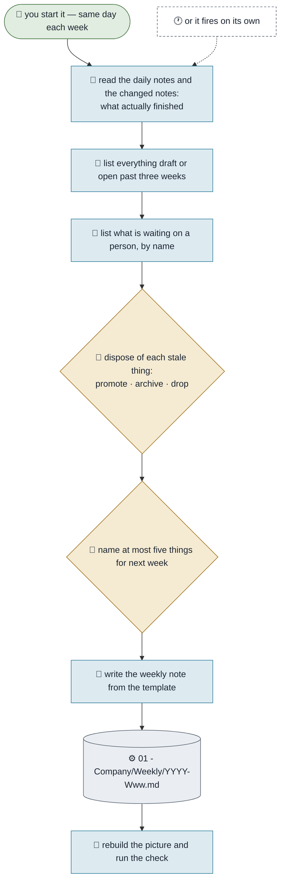

# Running Your Week

**Purpose.** Close the week honestly and open the next one. This is the workflow that stops a vault
becoming a graveyard: everything written down gets looked at once a week, and anything that has gone
stale gets a disposition rather than quietly rotting into something agents will read as true.
**Trigger.** The end of your working week. Friday afternoon works; the day matters less than the fact
that it is the same day every week.
**Done means.** A weekly note exists with what actually finished, every stale thing disposed of, at most
five things named for next week, and one line of what you learned — or an honest blank.
**Owner.** Monica prepares it; you answer it.

## How it runs today

## The steps

| # | Step | Who | What they need | What comes out |
|---|---|---|---|---|
| 1 | Gather what finished | Monica | The week's daily notes and changed notes | A list, not a feeling |
| 2 | Find everything stale past three weeks | Monica | `status` and `updated` on every note | The rot list |
| 3 | Name what is waiting on a person | Monica | The picture | Each one with its cost of silence |
| 4 | **Dispose of every stale thing** | You | Step 2 | Promote, archive or drop — nothing survives untouched |
| 5 | Name at most five things for next week | You | Judgement | A week somebody could actually have |
| 6 | Write the note, rebuild, check | Monica | The template | A weekly record and a true picture |

## Where it breaks

| The exception | How often | What we do |
|---|---|---|
| The week is skipped | The first failure, always | Catch up on Monday and say it was a catch-up. A skipped week silently marked as done is worse than an honest gap |
| Stale things are read but not disposed of | Most weeks, early on | Step 4 is the only step that cannot be deferred — a list you look at without acting on trains you to ignore it |
| "What we learned" gets invented | Whenever it feels required | Leave it blank. A manufactured lesson costs more than an empty line |
| Next week gets twelve items | Constantly | Five is the cap because twelve was never going to happen; the other seven are being deferred whether you write them or not |

## What it would take to automate

| Step | Could an agent do it? | What is missing |
|---|---|---|
| 1, 2, 3, 6 | Yes, today | Nothing |
| 4, 5 | No | Disposing and choosing are judgement, and the point of the workflow |
| Starting itself on a schedule | Yes — **the Rhythm package** | A scheduled pass, deliberately not in the base |
