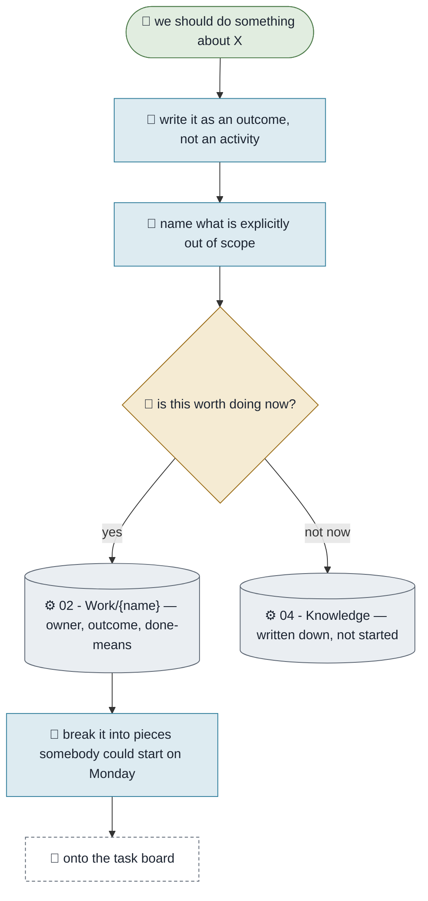

# Setting Up a Project

**Purpose.** Turn "we should do something about X" into a piece of work with a stated outcome, a named
owner and a way to tell whether it worked. The generic example — **rewrite it in your own words**; it is
here so you have something to adapt rather than a blank page.
**Trigger.** Someone says "we should", twice.
**Done means.** A project note exists with an outcome, an owner, what is out of scope, and how you will
know it is done.
**Owner.** Monica.

## How it runs today

## The steps

| # | Step | Who | What they need | What comes out |
|---|---|---|---|---|
| 1 | State the outcome, not the activity | Monica | The ask | "X can do Y" rather than "build Y" |
| 2 | Name what is out of scope | Monica | Judgement | A boundary that stops scope creep |
| 3 | Decide whether it is worth doing now | You | Steps 1–2 | Yes, or written down and not started |
| 4 | Write the project note | Monica | The template | A note with an owner |
| 5 | Break it into startable pieces | Monica | The note | Work somebody could begin Monday |
| 6 | Put the pieces on the board | — | **The Board package** | Not in the base |

## Where it breaks

| The exception | How often | What we do |
|---|---|---|
| The outcome is really an activity | Most first drafts | Ask "and then what is different?" until it is an outcome |
| No owner, or everyone owns it | Common | Leave `owner` blank rather than writing a name that is not true — the blank is visible in the check |
| It is already half-built before anyone writes it down | Often | Write the note anyway, and state what already exists |

## What it would take to automate

| Step | Could an agent do it? | What is missing |
|---|---|---|
| 1, 2, 4, 5 | Yes, today | Nothing |
| 3 | No | Whether it is worth doing now is yours |
| 6 | Yes | The Board package — a connected tracker and the discipline that keeps it truthful |
