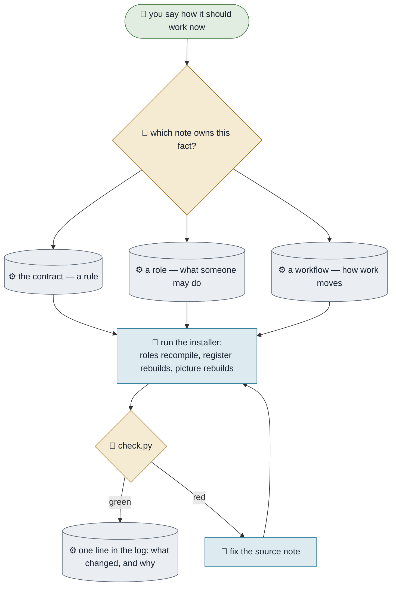

# Changing How You Work

**Purpose.** When the way you work changes, change it in one place and let everything downstream follow —
instead of discovering six months later that three documents describe three different organisations.
**Trigger.** A rule changes, a role changes, a workflow changes, or you decide something that lands on
any of them.
**Done means.** The one note that owns the fact is edited, the installer has run, the check is green, and
one line records what changed and why.
**Owner.** Athena.

## How it runs today

## The steps

| # | Step | Who | What they need | What comes out |
|---|---|---|---|---|
| 1 | Say what changed, in plain words | You | — | Intent |
| 2 | Find the **one** note that owns it | Athena | The contract's routing table | A single target |
| 3 | Edit that note, and only that note | Athena | — | A changed source |
| 4 | Run the installer | Agent or you | Python | Everything downstream agrees |
| 5 | Check, then log one line | Athena | — | A green check and a record |

## Where it breaks

| The exception | How often | What we do |
|---|---|---|
| The same rule is written in two places | The classic failure | Delete one. Two copies of a rule is two rules |
| The change is made in the generated output | Early on | It vanishes at the next build; fix the source |
| Nobody logs why | Usually | Six months later nobody remembers, and it gets reverted by someone reasonable |

## What it would take to automate

| Step | Could an agent do it? | What is missing |
|---|---|---|
| 2–5 | Yes, today | Nothing |
| 1 | No | Deciding how you work is not delegable |
