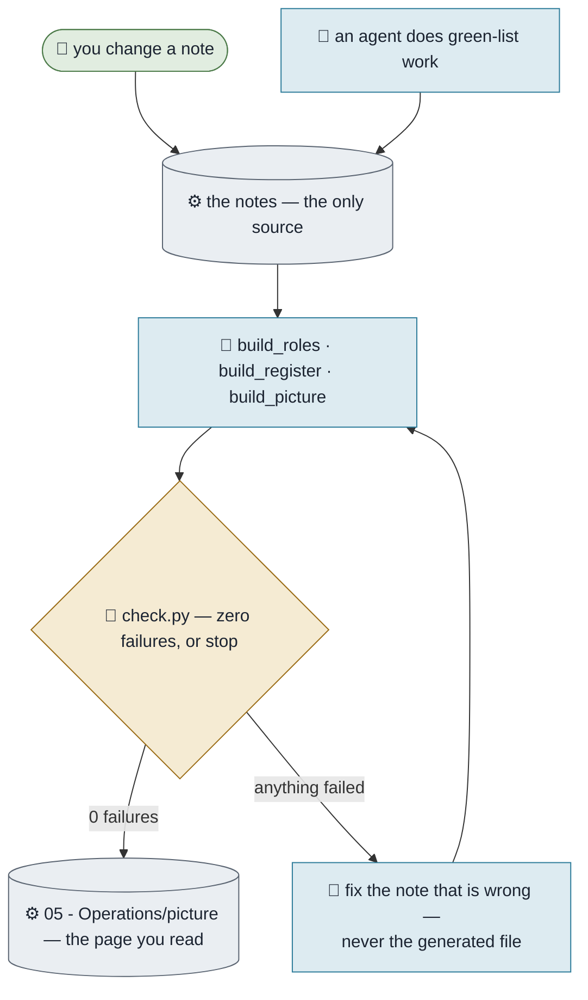

# Keeping the Picture True

**Purpose.** The page everyone reads rebuilds itself from the notes, and a check refuses it when a
stated number would be untrue. This is the loop the whole framework exists to protect.
**Trigger.** Any change to a note that the picture draws from; and whenever you are about to show anyone
the page.
**Done means.** Every generator has run against the current notes, the check reports zero failures, and
the page you are looking at is the one that was just built.
**Owner.** Athena.

## How it runs today

## The steps

| # | Step | Who | What they need | What comes out |
|---|---|---|---|---|
| 1 | Change the one note that owns the fact | Anyone | To know which note that is | A changed source |
| 2 | Run the generators | Agent or you | Python | A rebuilt register and page |
| 3 | Run the check | Agent or you | — | Zero failures, or a named untruth |
| 4 | Fix the **note**, not the output | Agent or you | The failure message | A true source |
| 5 | Look at the page | You | — | Confidence it is current |

## Where it breaks

| The exception | How often | What we do |
|---|---|---|
| Someone edits the generated page because it was faster | Once per new person | It is overwritten on the next build. That is the design, not a bug — say so once and move on |
| The check fails on something no script can fix | Weekly at first | It goes on the list of what is waiting on a person, by name |
| The page is built but never looked at | The quiet failure | The page states when it was built. If that date is old, nobody is running the loop |

## What it would take to automate

| Step | Could an agent do it? | What is missing |
|---|---|---|
| 2, 3, 4 | Yes, today | Nothing |
| 5 | No | Looking at it is the human part |
| Running it on a clock | Yes — that is the Rhythm package | Scheduled passes, which the base deliberately leaves out |
