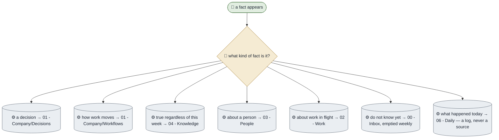

# Where Every Fact Lives

**Purpose.** One home per fact, and a written rule for which home. This is not really a sequence of
steps — it is the rule the other workflows depend on, written down so it can be enforced rather than
remembered.
**Trigger.** Anything is written down.
**Done means.** The fact is in exactly one note, and anyone could find it without asking.
**Owner.** Athena.

## How it runs today

## The rules

| # | Rule | Why |
|---|---|---|
| 1 | A fact lives in exactly one note | Two homes means two answers and no way to tell which is current |
| 2 | Logs point at home notes; they never restate them | A restated fact is a second home that nobody updates |
| 3 | The inbox is triage, not storage | Anything still there next week was never going to be filed |
| 4 | Generated files are not homes | Editing one is editing a copy that is about to be overwritten |
| 5 | If a fact has no home, make the home before writing it twice | The second mention is where drift starts |

## Where it breaks

| The exception | How often | What we do |
|---|---|---|
| A fact genuinely spans two areas | Occasionally | Pick the home by who would notice it is wrong, and link from the other |
| A daily note becomes the only record of something | Weekly, early on | Move it to a home note and leave the log pointing at it |
| A generated file is treated as a source | Once per new person | The check catches a count that disagrees with its notes |

## What it would take to automate

| Step | Could an agent do it? | What is missing |
|---|---|---|
| Routing a new fact | Yes, today | Nothing |
| Noticing a fact has two homes | Partly | A duplicate-claim check, which is on the list for a later package |
