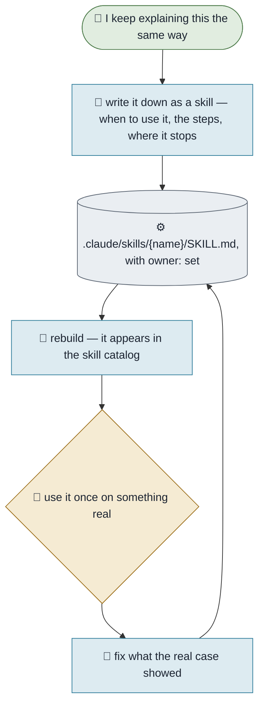

# Teaching an Executive a Skill

**Purpose.** Give an executive a capability it did not have — a way of doing one thing properly, written
down once and used the same way every time. A skill is the difference between an agent that improvises
and one that follows your method.
**Trigger.** You explain the same approach to an executive twice.
**Done means.** A skill exists in `.claude/skills/`, names its executive in `owner:`, appears on the
Skills page, and somebody has used it once.
**Owner.** Khloé.

## How it runs today

## The steps

| # | Step | Who | What they need | What comes out |
|---|---|---|---|---|
| 1 | Say what you keep repeating | You | Your own words | The method, out loud |
| 2 | Write it as a skill | Khloé | `_Templates/Skill.md` | `.claude/skills/{name}/SKILL.md` |
| 3 | Say when it applies | Khloé | Step 1 | A description concrete enough to trigger on |
| 4 | Set owner: to its executive | Khloé | A name or a job title | It appears under that executive in the catalog |
| 5 | Use it on something real | You | A live case | Proof, or a list of what it got wrong |
| 6 | Fix what the case showed | Khloé | Step 5 | A skill that survived contact |

## Where it breaks

| The exception | How often | What we do |
|---|---|---|
| The description is vague, so nothing ever triggers it | Most first drafts | Name the situation, not the topic |
| It is written with no `owner:`, so nothing reaches for it | Easy to do | The catalog lists it under *Nobody reaches for these* and the check fails — set `owner:` |
| The skill quietly becomes a second copy of a workflow | Common | A workflow is how work moves; a skill is how one step is done well. If it has an owner and a trigger, it is a workflow |
| It is written from how you wish you worked | Always tempting | Write the version that includes the messy part |

## What it would take to automate

| Step | Could an agent do it? | What is missing |
|---|---|---|
| 2, 3, 4, 6 | Yes, today | Nothing |
| 1, 5 | No | What you keep repeating, and whether it worked, are yours |
