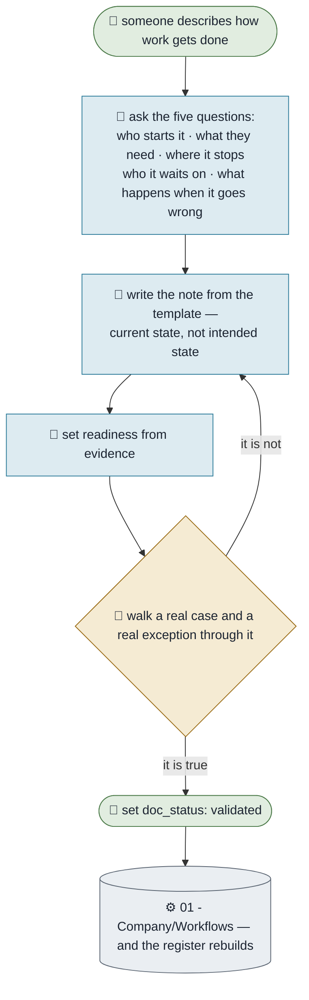

# Writing a Workflow Down

**Purpose.** Turn something people do from memory into a note a machine can read and a colleague can
follow. This is the workflow the whole framework rests on: nothing can be automated, checked or improved
until it has been written down honestly.
**Trigger.** Anyone says "how do we do X?", or does X for the second time.
**Done means.** A note exists from the template, its diagram shows the current state including the ugly
parts, its exceptions are listed, and its two marks are set honestly.
**Owner.** Khloé.

## How it runs today

## The steps

| # | Step | Who | What they need | What comes out |
|---|---|---|---|---|
| 1 | Describe it out loud, badly | Whoever does the work | Nothing | A messy account |
| 2 | Ask the five questions | Khloé | The account | Gaps named |
| 3 | Write the note from the template | Khloé | The template | A draft note |
| 4 | Set `readiness` from evidence | Khloé | Honesty | not-yet · partly · ready |
| 5 | Walk a real case through it | A person | One real case, one exception | Corrections |
| 6 | Set `doc_status: validated` with the date | A person | Step 5 done | A note that is true |

## Where it breaks

| The exception | How often | What we do |
|---|---|---|
| The person describes how it *should* work | Most first attempts | Ask what happened the last three times instead |
| Two people describe it differently | Common across teams | Write both, name the fork in the diagram — the disagreement is the finding |
| Nobody actually owns it | More often than anyone admits | Write the note anyway and leave `owner` blank. The blank is the point |

## What it would take to automate

| Step | Could an agent do it? | What is missing |
|---|---|---|
| 1–4 | Yes, today | Nothing |
| 5–6 | No, and never | A machine cannot confirm a description of reality by reading it |
