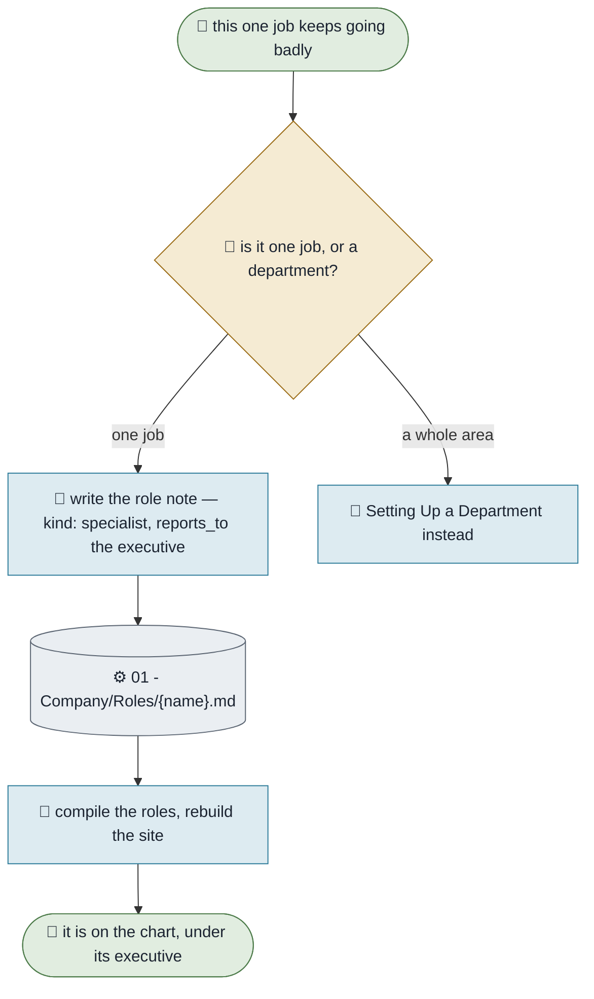

# Adding a Specialist

**Purpose.** Put a narrow agent under an executive: one job, done properly, handed back when the question
is anything else. Executives cover a department; specialists cover a task inside it.
**Trigger.** An executive keeps doing one fiddly thing badly, or keeps doing it so often it crowds out
everything else.
**Done means.** A role note with `kind: specialist` exists, reports to an executive, is compiled into an
agent, and appears under that executive on the organization page.
**Owner.** Bragi.

## How it runs today

## The steps

| # | Step | Who | What they need | What comes out |
|---|---|---|---|---|
| 1 | Name the one job | You | The thing that keeps going wrong | A job narrow enough to describe in a sentence |
| 2 | Check it is not a department | You | Judgement | If it has several kinds of work in it, it is a department |
| 3 | Write the role note | Bragi | `_Templates/Specialist.md` | `kind: specialist`, `reports_to:` its executive, `department:` the one it works in |
| 4 | Say where it stops | Bragi | Step 1 | The `not_owned` list — the part that makes its answers worth having |
| 5 | Compile and rebuild | Bragi | The generators | An agent, and a dashed box under its executive on the chart |

## Where it breaks

| The exception | How often | What we do |
|---|---|---|
| The specialist is really a second executive | Common | If it answers for an area rather than a task, make it a department. The check will not stop you; judgement has to |
| It reports to nobody | Easy to forget | The check catches it: a specialist whose `reports_to` names no role is named by name |
| Five specialists under one executive | Eventually | Fine, if each does one job. Not fine if three of them overlap — that is one specialist written three times |

## What it would take to automate

| Step | Could an agent do it? | What is missing |
|---|---|---|
| 3, 4, 5 | Yes, today | Nothing |
| 1, 2 | No | Which job keeps going wrong, and whether it is one job, are yours |
